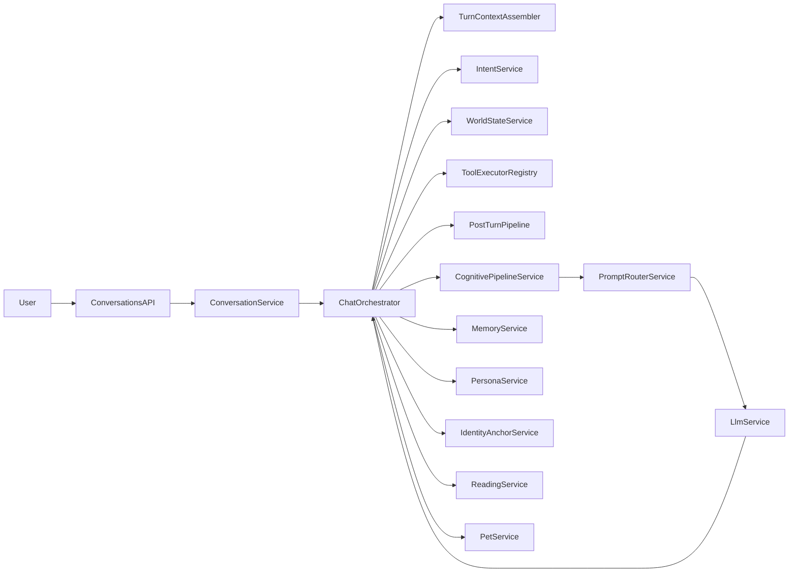

# 小晴 — 架构设计说明（Architecture Design Document）

> 面向中高级工程师与架构面试；长期维护，随需求与实现同步更新。  
> 文档定位：设计动机、边界划分、权衡取舍；非产品宣传、非拟人化叙事。

---

## 1. 系统背景说明

小晴不是一次性聊天机器人，而是一个**长期存在、具备连续状态**的对话系统。用户与系统的关系是持续的：多轮对话、多次会话、跨越时间的记忆与人格一致性。

核心挑战来自「长期」带来的四个问题：

- **状态长期积累**：上下文不能无限堆叠，必须分层、截断与选择性注入。
- **记忆不可控增长**：若所有信息都写入长期记忆，存储与推理成本会失控，且错误与噪音会被固化。
- **推理前提不稳定**：用户所在地、时区、语言等会变化，若每轮都反问会破坏体验；若从不更新则推理错误。
- **人格与阶段目标混杂**：人格（约束与风格）应与「当前在聊什么」区分，避免把阶段性结论误写入人格层。

本架构针对上述问题，通过**分层状态、规则驱动的记忆与人格、默认世界状态与阶段上下文**来保证长期可用性与可控性。

---

## 2. 核心设计目标

系统需要解决的本质问题可归纳为：

| 目标 | 说明 |
|------|------|
| **避免上下文腐化** | 通过固定窗口（最近 N 轮）+ 记忆召回 + token 预算截断，避免无限拉长上下文导致的注意力稀释与成本爆炸。 |
| **防止错误理解被长期放大** | 长期记忆写入需规则/人工约束；纠错记忆（correction）可覆盖或关联原条目；一次性事实不写入长期。 |
| **区分「记忆」与「世界状态」** | 世界状态是默认成立的前提（地点、时区、语言），用于意图补全与推理，不参与回忆、不写入 Memory 表。 |
| **支持长期演进而不重构** | 记忆分层（mid/long）、记忆类别（身份锚定独立表 + Memory 表内 shared_fact/commitment/correction/soft_preference/general 等）、人格双池、可扩展的技能与意图槽位，均为演进预留接口。 |

---

## 3. 总体架构概览

以下为逻辑分层（自底向上），各层职责与边界明确，便于维护与面试表述。

- **Input Layer（用户输入）**  
  用户单条消息进入系统；可选附带会话 ID、前端上下文。仅做接收与路由，不做语义理解。

- **Intent & Context Resolution（意图与上下文补全）**  
  基于最近 N 轮 + 本轮输入，由 LLM 输出结构化意图（mode、requiresTool、taskIntent、slots、missingParams、worldStateUpdate 等）。  
  随后用 **World State** 对 slots 与 missingParams 做补全，得到「合并后意图」；策略决策（是否反问、走工具还是聊天）基于合并后意图，避免在已有默认前提时多余追问。

- **World State（默认世界状态）**  
  会话级稳定前提（如 city、timezone、language）。不参与回忆，仅参与意图槽位补全与 Chat system 文案注入。  
  仅当意图解析出用户**显式声明**变化时更新；覆盖式更新，不追加。

- **Phase Context（阶段上下文）**  
  当前对话阶段的即时上下文：最近 N 轮消息 + 当前意图状态。生命周期限于「本阶段」；新话题或新会话阶段开始时，被新的 recent + 新意图替代。  
  不写入 Memory 表，不参与回忆；与长期记忆的区别是「仅当轮有效、不沉淀」。

- **Cognitive Memory（基础记忆能力）**  
  身份锚定存于独立表 `IdentityAnchor`（不参与记忆召回与衰减）；Memory 表内为其余 8 类（共识事实、弱承诺、纠错记忆、软偏好、通用、judgment_pattern、value_priority、rhythm_pattern），每类有写入条件、召回权重与衰减策略。  
  负责「什么该记、怎么记、何时衰减」。详见 [identity-anchor-design.md](identity-anchor-design.md) 与 [memory-growth-plan.md](memory-growth-plan.md) 中的成长闭环说明。

- **Long-term Memory / 人格层**  
  长期记忆条目（Memory 表 long 型）+ 结构化人格（Persona 表：4 人格字段 + 3 表达调度字段 + 进化约束）。  
  人格进化受双池约束，必须经校验与人工确认后才写入；进化可精确到字段级（如仅调整 voiceStyle）；长期记忆写入由规则/总结触发，非模型自决。

- **Expression Policy（表达调度）**  
  控制「说多少、怎么说」的输出调度层，与人格设定（说什么、相信什么）分离。  
  由 3 个结构化字段组成：`voiceStyle`（语言风格基线）、`adaptiveRules`（自适应展开/收缩条件）、`silencePermission`（留白许可）。  
  放在 system prompt 末尾（紧邻生成位置）；`adaptiveRules` 根据 `intentState` 动态增强，使输出密度可感知对话状态。  
  详见 [docs/expression-policy-design.md](expression-policy-design.md)。

- **Response Generation（响应生成）**  
  根据路由结果：纯聊天路径则组装 ChatContext（personaPrompt + identityAnchor + 召回记忆 + intentState + worldState + expressionPolicy + 最近消息）调用 LLM；工具路径则执行技能后包装再回复。  
  Prompt 版本化（当前 **`chat_v6`**，由 `PromptRouterService.CHAT_PROMPT_VERSION` 常量控制），token 预算内截断，保证可复现与成本可控。  
  **Prompt 家族与版本**：chat `chat_v6`、summary `summary_v2`、memory-analysis `memory_analysis_v1`、reading `reading_v1`、tool-wrap `tool_wrap_v1`、rank `rank_v1`。  
  **PromptRouter** 职责已扩展为：全部 prompt 家族组装、记忆精排（LLM 精排 + token 预算截断）、表达策略注入的集中层；debug/trace 中的 `promptVersion` 应直接取自上述常量，避免硬编码。

各层之间：**Input → Intent（含 World State 补全）→ 策略决策 → 若聊天则 Memory 召回 + World State 注入 + Expression Policy 注入 → Response**。  
World State 与 Phase Context 不进入 Memory 召回；记忆召回结果、World State、intentState 与 Expression Policy 一起进入 Response 的 system prompt。

### 3.1 后端模块与目录（backend/src）

| 目录 | 职责 |
|------|------|
| `conversation/` | 会话 facade 与主编排（`ConversationService` facade + `ChatOrchestrator` 主链） |
| `memory/` | 记忆 CRUD、衰减、召回、写入守卫、定时任务 |
| `persona/` | 7+2 字段人格、印象、进化双池（含 EvolutionScheduler） |
| `summarizer/` | 总结 → 记忆写入 → 印象/身份锚定抽取 |
| `prompt-router/` | 全部 prompt 家族构建、记忆精排、表达策略注入 |
| `llm/` | LLM 封装，统一配置模型与 mock |
| `world-state/` | 会话级默认前提管理与意图槽位补全 |
| `identity-anchor/` | 用户身份锚定独立表与注入 |
| `cognitive-pipeline/` | 认知管道 + CognitiveGrowthService + BoundaryGovernanceService |
| `intent/` | 意图解析、DialogueIntentState、worldStateUpdate/identityUpdate 等信号 |
| `openclaw/` 与 `skills/*` | 外部工具编排与本地优先技能（天气、本地电子书下载） |
| `tools/` | 工具统一执行入口（`ToolRequest` / `ToolExecutionResult` / `ToolExecutorRegistry`） |
| `post-turn/` | 后处理编排（`PostTurnPlan` + `PostTurnPipeline`，beforeReturn/afterReturn） |
| `reading/` | 读物摄入、ReadingInsight 管道、采纳到记忆/人格 |
| `pet/` | Live2D 小宠物状态（SSE）同步 |
| `trace/` | `TraceStep` / `TraceCollector` + `TurnTraceEvent` 适配层（兼容并行） |

### 3.2 模块交互示意

### 3.3 Orchestration 重构落地状态（2026-03-09）

当前代码已完成低风险重构的“对象落地 + 主链接入”：

- `ConversationService.sendMessage()` 已改为 facade 入口，委托 `ChatOrchestrator.processTurn()`。
- 新增 `TurnContext` / `TurnDecision` / `TurnContextAssembler`，用于收口稳定共享上下文。
- 本地 weather、book-download、openclaw 执行已接入 `ToolExecutorRegistry` 统一入口。
- 新增 `PostTurnPlan` / `PostTurnPipeline`，主链按 `beforeReturn` / `afterReturn` 调度后处理任务。
- trace 层新增 `TurnTraceEvent` 与 adapter，当前仍保留 `TraceStep` 输出兼容旧消费方。

已遵循“行为不变优先”：未调整 prompt 文本版本、memory recall 算法阈值、cognitive heuristics 与工具参数语义。

---

## 4. World State（默认世界状态）

### 4.1 定义

**World State** 是「对话前提」的会话级表示：一旦被用户确定，在未被**显式修改**前默认成立。  
它**不是记忆**：不参与回忆、不写入 Memory 表、不参与情感/偏好/人格推导；仅用于意图补全与推理前提（如「几点了」「今天天气怎么样」）。

### 4.2 为什么不属于记忆

- 记忆用于「回忆」：在对话前被召回、注入，以体现「记得你」。  
- 世界状态用于「默认成立」：减少反问（如「你在哪个城市？」），直接参与槽位补全与 system 中的前提描述。  
- 若把地点/时区当记忆处理，会与人格、偏好混在一起，且容易被总结成冗长自然语言，难以稳定参与意图解析。

### 4.3 典型字段

| 字段 | 含义 | 参与意图补全的典型用途 |
|------|------|---------------------------|
| `city` | 城市/地区名 | 天气等技能的 `slots.city`（缺地点时补全） |
| `timezone` | 时区（如 JST、Asia/Shanghai） | 「几点了」等推理前提 |
| `language` | 用户偏好语言（如 zh-CN、ja） | 回复语言与本地化 |
| `device` | 设备（如 desktop、mobile） | 可选，预留 |
| `conversationMode` | 当前对话模式 | 可与意图 mode 同步，可选 |

存储于 `Conversation.worldState`（JSON），按会话独立；不同对话可有不同默认前提。

### 4.4 参与意图补全的流程

1. 意图识别输出 `intentRaw`（含 `slots`、`missingParams`、可选 `worldStateUpdate`）。
2. 若有 `worldStateUpdate` 且字段有效，则对 World State 做**覆盖**更新。
3. `mergeSlots(conversationId, intentRaw)`：对需要工具的意图（如 weather_query），若缺 `city` 且 World State 有 `city`，则补全 `slots.city` 并从 `missingParams` 移除 `city`。
4. 策略决策基于 **mergedIntent**：仅当合并后仍存在缺失参数时才走 `ask_missing`（反问用户）。

因此：**已有默认地点时不再反问「你在哪个城市？」**。

### 4.5 何时更新、何时覆盖

- **更新**：仅当意图解析结果中带有 `worldStateUpdate` 且某字段为有效非空字符串时，对该字段执行**覆盖**更新（如用户说「我现在在大阪」→ 更新 `city`）。  
- **覆盖**：每次更新都是字段级覆盖，不追加、不合并历史。  
- **不更新**：用户未显式声明变化时，不根据对话内容猜测或自动改写 World State。

---

## 5. Phase Context（阶段上下文）

### 5.1 生命周期

阶段上下文 = **当前对话阶段内**的即时输入：最近 N 轮消息 + 当前意图状态（mode、taskIntent、slots 等）。  
生命周期限于「本阶段」：当用户切换话题或进入新任务时，新的 recent 与新的意图自然替代旧内容；不单独做「阶段结束」事件。

### 5.2 与长期记忆的区别

| 维度 | Phase Context | 长期记忆（Memory） |
|------|----------------|---------------------|
| 存储 | 不单独存储，仅作为当轮请求的输入（recent + intent） | 写入 Memory 表，可查可编可回溯 |
| 参与回忆 | 不参与 | 参与 getCandidatesForRecall 与注入 |
| 时效 | 当轮有效，随窗口滑动被挤出 | 长期保留，依赖衰减与人工清理 |

### 5.3 如何被新阶段替代

- 最近 N 轮由配置固定（如 8 轮）；新消息进入后，最老的消息被挤出窗口。  
- 意图每轮重新识别；新一轮的 intent 自然覆盖上一轮的「当前意图」。  
- 不显式标记「阶段结束」；通过「只保留最近 N 轮」与「每轮重算意图」实现阶段信息的自然更替。

### 5.4 如何避免阶段信息残留

- 不把「当前阶段」写成一条记忆条目写入 Memory；阶段内结论若需保留，须经**总结流程**（手动或规则触发）抽取为 mid/long，由 WriteGuard 与 category 决定是否写入。  
- 注入到 Chat 的只有：persona、identityAnchor、召回的记忆、worldState、intentState、最近 N 轮消息；不注入「上一阶段摘要」等未结构化文本，避免阶段目标与人格混淆。

---

## 6. Cognitive Memory Primitives（基础记忆能力）

身份锚定存于**独立表** `IdentityAnchor`，不占用 Memory 表；Memory 表内为其余 8 类原语，每类对应明确的设计动机、触发与存储原则及边界。  
实现上对应 `Memory.category` 与 `memory-category.ts` 中的配置（衰减、召回权重等）；身份锚定实现见 `backend/src/identity-anchor/` 与 [identity-anchor-design.md](identity-anchor-design.md)。

### 6.1 Identity Anchor（身份锚定）

- **存储位置**：独立表 `IdentityAnchor` + `IdentityAnchorHistory`（按会话全局，非 Memory 表）。Memory 表仍保留 `identity_anchor` 类别仅用于迁移期兼容，召回时不再从 Memory 读取身份锚定。  
- **设计动机**：需要「用户是谁」的稳定锚点（如称呼、身份简述），保证回复始终知道在跟谁对话，且不因时间或话题被挤出。  
- **触发条件**：用户或管理员在前端设置/更新「身份锚定」；或总结流程在严格规则下产出 identity 类候选（若未来开放）。  
- **存储原则**：最多 5 条（可配置），不参与衰减；召回时**始终注入**（由 IdentityAnchorService.getActiveAnchors 按 sortOrder 拼接），不参与 Memory 的竞争排序。  
- **不做什么**：不把日常偏好、单次事实写入身份锚定；不随每轮对话自动改写。

### 6.2 Shared Facts（共识事实）

- **设计动机**：用户与系统共同认可的可长期使用的背景事实（如工作城市、常用语言、长期偏好）。  
- **触发条件**：总结时由 LLM 标注为 shared_fact，或人工在记忆页标记；经 WriteGuard 判为 WRITE/MERGE 后写入。  
- **存储原则**：长半衰期（如 90 天）、命中加成较高；可被纠错覆盖或关联。  
- **不做什么**：不把一次性、情境相关的事实标成共识事实；不自动从单轮对话直接写入。

### 6.3 Commitment Awareness（弱承诺）

- **设计动机**：用户表达过的「打算」「计划」类弱承诺（如「下周想跑步」），有时效性，不应永久等同事实。  
- **触发条件**：总结时标注为 commitment；WriteGuard 通过后写入。  
- **存储原则**：短半衰期（如 14 天），过期后优先进入衰减候选，避免长期当作既定事实。  
- **不做什么**：不把已完成的承诺长期高权重保留；不把强约束（如「绝不……」）仅当弱承诺处理（可归入人格或 correction）。

### 6.4 Error / Correction Memory（纠错记忆）

- **设计动机**：用户纠正之前的误解（如「我不是那个意思」「其实我在北京」），必须能覆盖或关联原记忆，避免错误被长期放大。  
- **触发条件**：总结输出标注为否定/纠正（isNegation）或 category=correction；WriteGuard 判为 OVERWRITE 或 WRITE_AND_LINK。  
- **存储原则**：中半衰期；召回权重较高，确保纠正优先于被纠正内容。  
- **不做什么**：不把普通偏好更新当纠错；不自动删除原条目而不留纠正记录（优先 OVERWRITE/MERGE 或 LINK，保证可回溯）。

### 6.5 Soft Preference（软偏好）

- **设计动机**：用户表现出的倾向（如回复长度、话题偏好），可随时间变化，不应与「共识事实」同等权重。  
- **触发条件**：总结或人格相关流程标注为 soft_preference；经 WriteGuard 写入或合并。  
- **存储原则**：中半衰期（如 45 天）；召回权重略低于共识事实与纠错。  
- **不做什么**：不把明确表达的硬偏好（如「不要提某话题」）仅当软偏好；不自动从单句推断强偏好并写入长期。

### 6.6 Forgetting / Decay（遗忘机制）

- **设计动机**：「不会忘的系统一定会坏」：长期不用的记忆应能降权甚至清理，避免存储与上下文被陈旧的、低价值信息占满。  
- **触发条件**：按时间与命中次数计算衰减分（如 2^(-daysSinceAccess/halfLife) + hitBoost×hitCount）；低于 category 的 minScore 时进入候选删除。  
- **存储原则**：identity_anchor 不衰减；其余 category 配置不同半衰期与 minScore；支持手动重算衰减与批量清理候选。  
- **不做什么**：不自动物理删除（先候选，由人工或显式策略确认清理）；不对身份锚定做衰减。

---

## 7. Cognitive Pipeline（认知管道与成长/边界）

认知管道模块（`cognitive-pipeline/`）在每轮对话中提供稳定的决策层：在组装 prompt 与调用 LLM 之前，先分析当轮情境与用户状态，输出结构化策略与边界提示。

- **输入**：`CognitiveTurnInput`（userInput、recentMessages、intentState、worldState、growthContext）。
- **输出**：`CognitiveTurnState`（situation、userState、responseStrategy、judgement、value、emotionRule、affinity、rhythm、安全 flags、userModelDelta 等），供 PromptRouter 注入 system prompt。
- **调用点**：
  - 聊天路径：`ConversationService.handleChatReply()`
  - 工具路径：`buildToolReplyAndSave()`、`handleMissingParamsReply()`
- **关联服务**：
  - **CognitiveGrowthService**：提供 `growthContext`（长期认知画像/节奏等），每轮对话后通过 `recordTurnGrowth` 记录成长信号；与 [memory-growth-plan.md](memory-growth-plan.md) 中的成长闭环一致。
  - **BoundaryGovernanceService**：在 prompt 构建前生成 preflight 提示、在 LLM 输出后对回复做边界复核与必要改写。
- **可观测**：决策链路可通过 [debug-trace-design.md](debug-trace-design.md) 中的 trace 步骤查看；自动人格进化建议由总结后 `triggerAutoEvolution` 触发，见 memory-growth-plan 中的 B2。

---

## 8. 记忆写入与更新策略

### 8.1 什么情况下写入

- 总结流程（手动或规则触发）产出候选，且 WriteGuard 判为 WRITE、WRITE_AND_LINK、OVERWRITE 或 MERGE。  
- 置信度 ≥ 阈值（如 0.4）；非一次性事实写入长期；纠错时允许覆盖或关联原条目。  
- 身份锚定由用户/管理员显式设置或更新。

### 8.2 什么情况下拒绝写入

- 置信度低于阈值 → SKIP。  
- 明确否定但找不到可覆盖/关联的已有记忆，且非 correction 类型 → SKIP。  
- 一次性事实且类型为 long → SKIP（不把一次推理用到的信息固化为长期记忆）。  
- 与已有记忆相似度超过重复阈值 → MERGE（不重复写入）。

### 8.3 如何覆盖、修正、删除

- **覆盖**：WriteGuard 判为 OVERWRITE 时，用新内容更新目标记忆条目（纠错场景）。  
- **修正/关联**：WRITE_AND_LINK 时写入新条目并关联到被纠正条目的 ID（若实现 link 表或字段）。  
- **合并**：MERGE 时更新目标条目的 content/sourceMessageIds，不新增条目。  
- **删除**：衰减分低于 minScore 的条目进入候选列表；通过 decay/cleanup 等 API 显式传入 ID 列表做物理删除或软删除。

### 8.4 为什么「不会忘的系统一定会坏」

- 存储与 token 预算有限，若只增不减，成本与延迟会持续上升。  
- 陈旧、错误或已过时的记忆会干扰当前推理，导致回复偏离或自相矛盾。  
- 用户期望「过时的承诺/偏好」不再被强调；遗忘机制使系统行为更贴近「有时效的认知」，而非僵化的全量记忆。

---

## 9. 关键设计权衡

| 权衡维度 | 选择 | 理由 |
|----------|------|------|
| **记忆完整性 vs 系统稳定性** | 偏向稳定性：严格写入条件、衰减与候选删除，宁可少记也不让错误与噪音无限积累。 | 长期对话中，错误记忆的破坏力大于「漏记」；可查可编可回溯优先于「记全」。 |
| **智能反问 vs 默认前提** | 用 World State 补全槽位，仅在补全后仍缺失时才反问。 | 减少重复追问（如每次查天气都问城市），在「不替用户做主」与「体验连贯」之间取平衡。 |
| **拟人化体验 vs 工程可控性** | 人格与风格通过 Persona 与 prompt 控制；记忆与意图由规则与配置驱动，不交给模型自决。 | 可复现、可审计、可演进；避免模型自行决定写长期记忆或改变人格导致的不可控。 |
| **自动进化 vs 人工确认** | 人格进化建议可自动生成，但写入人格层必须经进化池校验 + 人工确认。 | 防止人格漂移与越界；V1 不做无约束的自动进化。 |
| **召回相关性 vs 成本** | 规则初筛 + 关键词/衰减打分；候选过多时再用 LLM 精排，并设 token 预算截断。 | 在控制调用成本的前提下，尽量让注入记忆与当前话题相关。 |

---

## 10. 可扩展性与演进方向

- **任务系统**：当前已有意图与策略决策（如 ask_missing、run_local_weather、run_openclaw）；可扩展为更通用的任务编排、状态机与结果回写。  
- **外部工具调用**：OpenClaw 等外部技能已接入；可增加更多技能注册、参数 schema 与策略路由（如本地优先 vs 开放调用）。  
- **多人格或多模式**：Persona 当前为单例（结构化 7 字段：4 人格 + 3 表达调度）；可扩展为多套人格配置或按 conversationMode 切换不同 prompt/约束池。表达调度层独立于人格层，允许更频繁微调而不触及人格核心。  
- **读物摄入与人格化解读**：Phase3 已有 Reading/ReadingInsight；可继续扩展为更多类型的「外部输入 → 候选记忆/人格建议」管道。  

以上扩展均可在现有分层上增加模块或配置，而不破坏 World State、Phase Context、Cognitive Memory 与人格双池的边界。

---

## 11. 前端架构与 API 能力

### 11.1 前端模块与布局（frontend/src/app）

当前采用**单路由主聊天页 + 左侧多 tab 工具面板**：顶层仅有一条 `MainLayout` 路由，其 children 为 `''` 与 `chat/:id`，均渲染 `ChatComponent`；`memory` / `persona` / `identity` / `reading` / `debug` 并非独立路由，而是 MainLayout 左侧 tab 内嵌视图。

| 目录 | 职责 |
|------|------|
| `chat/` | `ChatComponent`：主聊天界面、trace 展示、进化提示 |
| `layout/` | `MainLayoutComponent`：左侧 tab + 右侧 router-outlet；顶部 `PersonaSummaryComponent` 作为侧栏 header |
| `conversation/` | 会话列表与管理（新建、重总结、删除） |
| `memory/` | 记忆列表/编辑、成长候选确认 |
| `persona/` | 人格配置、印象与进化审批 |
| `identity-anchor/` | 身份锚定、用户记忆分区、World State 编辑 |
| `reading/` | 读物摄入与 insight 采纳 |
| `debug/` | Debug Dashboard：记忆/人格/进化/token 观测 |
| `core/` | 各服务（conversation、memory、persona、growth、reading、identity-anchor、world-state） |

未来若拆成多页面（独立路由如 `/memory`、`/persona`），可在当前布局之上演进，无需重构架构层。

### 11.2 API 能力与模块边界

更细粒度的 REST 列表与字段说明由 CLAUDE.md 或单独 API 文档维护；此处仅列出能力范围与模块对应关系：

- **对话与消息**：`/conversations`、`/conversations/:id/messages`、`/conversations/:id/flush-summarize`
- **世界状态**：`/conversations/:id/world-state`
- **记忆**：`/memories` 及衰减/for-injection/清理与调试相关 API
- **人格与进化**：`/persona`、`/persona/impression*`、`/persona/evolve/*`
- **身份锚定**：`/identity-anchors*`、`history`、`migrate`
- **读物**：`/readings*`、`/readings/:id/adopt`
- **Pet**：`/pet/state-stream`、`/pet/state`

---

## 12. 总结

### 12.1 本质问题

本系统解决的是**长期存在、连续状态的对话系统**如何在「状态积累、记忆增长、推理前提、人格与阶段混杂」四个约束下，保持**可用、可控、可演进**。  
做法是：**分层状态**（World State / Phase Context / Cognitive Memory / 人格）、**规则驱动的记忆与人格**（写入/覆盖/衰减/召回）、**意图与槽位补全**（减少多余反问）、**双池约束的人格进化**（可进化但受控）。

### 12.2 刻意选择而非能力不足

- **不做自动写入长期记忆**：刻意选择，避免模型误判与噪音固化。  
- **不做无约束人格进化**：刻意选择，保证人格边界可审计、可回滚。  
- **World State 与记忆分离**：刻意选择，使「默认前提」与「可回忆内容」各司其职，便于意图与推理稳定。  
- **遗忘与衰减**：刻意选择，承认「不会忘的系统一定会坏」，用半衰期与候选删除换取长期稳定性与成本可控。  

以上均为架构级取舍，便于在技术面试中说明动机与边界。

---

**文档维护**：需求或实现发生变更时，应同步更新本文档（参见 `.cursor/rules/docs-sync.mdc` 及项目内「架构设计文档同步」规则）。  
- 新增或重构后端模块、或 PromptRouter 新增 prompt 家族时：优先更新本文档的模块列表与 §3.2 交互图，再视情况更新对应子文档（world-state / identity-anchor / debug-trace / expression-policy）。  
- Prompt 版本升级时：在 `PromptRouterService` 中更新常量后，同步更新本文档的版本说明，并核对 debug-trace-design 中 `promptVersion` 相关描述。
