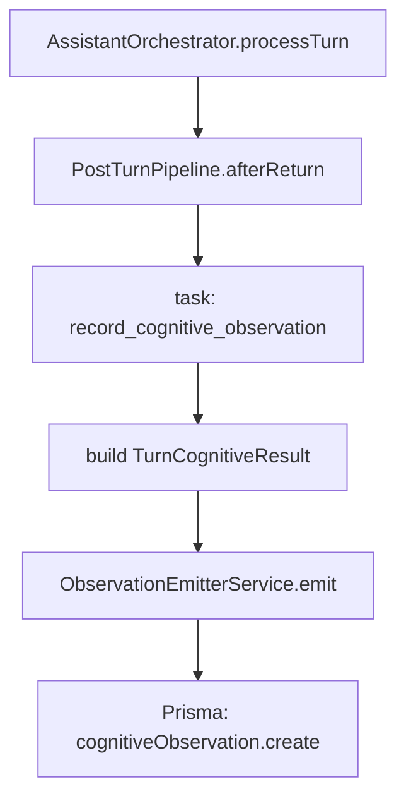

## Cognitive Trace（小晴认知溯源）— 架构设计说明

> 文档定位：把“小晴内部发生了什么”结构化为可查询、可展示、可聚合的认知轨迹（不是 debug 日志，也不是用户人生事件流）。
>
> 代码对齐：本文以当前实现为准（`backend/src/assistant/cognitive-trace/**` + `frontend/src/app/cognitive-trace/**`），并明确哪些仍是后续目标。

---

## 1. 背景与目标

### 1.1 为什么要做 Cognitive Trace

系统里已经存在大量“管线信号”（L0）：意图、世界状态补全、记忆召回、认知管道输出、成长层事件、post-turn 任务等。但这些信号更多面向调试或内部数据结构，用户难以理解其意义。

**Cognitive Trace 的目标**是把这些信号提炼为面向用户可解释的“认知观测”（L1），并提供按天/周聚合的能力（L2/L3），让用户能看到：

- 小晴这一轮**识别了什么**（情境/情绪/需求等）
- 小晴这一轮**决定了什么**（策略变化、先安抚后建议等）
- 小晴这一轮**有哪些可沉淀的成长信号**（画像确认、边界事件等）

同时保持边界清晰：

- **不替代** `Debug Trace`（`docs/debug-trace-design.md`）：后者是“系统怎么跑的”（步骤链路、耗时、调用策略）。
- **不替代** `Life Record / TracePoint`：后者是“用户生活发生了什么”（事件碎片、日摘要）。

---

## 2. 四层认知金字塔（L0-L3）

```text
L3  认知进化（CognitiveEvolution）   周/月级：洞察驱动的行为变化提议（需用户确认）
L2  认知洞察（CognitiveInsight）     日/周级：从观测聚合出的叙事、模式与指标
L1  认知观测（CognitiveObservation） 回合级：从管线信号提炼的可读认知节点（落库 + UI）
L0  管线信号（PipelineSignals）      原始：intent/worldState/memory/claim/cognitiveState/trace 等
```

### 当前落地情况（以代码为准）

- **已落地：L1 CognitiveObservation**（模型、写入、查询 API、前端看板）
- **Schema 已有但尚未实现服务/接口：L2 CognitiveInsight、L3 CognitiveEvolution**

对应 Prisma 模型见 `backend/prisma/schema.prisma`：`CognitiveObservation` / `CognitiveInsight` / `CognitiveEvolution`。

---

## 3. 数据模型（已落地：L1）

### 3.1 Prisma：`CognitiveObservation`

字段要点（以 `backend/prisma/schema.prisma` 为准）：

- **dimension**：`perception | decision | memory | expression | growth`
- **kind**：按维度细分（当前 TypeScript 侧在 `backend/src/assistant/cognitive-trace/cognitive-trace.types.ts` 定义）
- **title/detail**：可读标题 + 可选细节
- **source**：产出模块标识（如 `cognitive-pipeline`、`memory`、`claim-engine`）
- **significance**：0-1，重要性（用于噪音过滤）
- **payload**：结构化细节（Json）
- **relatedTracePointIds**：与 LifeRecord 的潜在关联（目前仅字段存在；自动关联策略尚未实现）

### 3.2 TypeScript：`TurnCognitiveResult`

`backend/src/assistant/cognitive-trace/cognitive-trace.types.ts` 定义了 `TurnCognitiveResult`，作为“一个回合的认知产出汇总”输入源：

- `cognitiveState: CognitiveTurnState`（认知管道输出）
- `memoryOps / claimOps / growthOps`（记忆/画像/边界等操作摘要）
- `strategyShifted`（是否偏离常规策略）

**现状说明**：当前 `AssistantOrchestrator` 在 post-turn 任务 `record_cognitive_observation` 中构造 `TurnCognitiveResult`，其中 `memoryOps/claimOps` 目前为空，`growthOps` 由 `CognitiveTurnState` 推断（见下文）。

---

## 4. 数据流与触发点（已落地：L1 写入）

### 4.1 写入时机：PostTurn afterReturn

后端通过 post-turn 任务 `record_cognitive_observation` 异步写入观测，避免影响对话主链路延迟。

- 任务类型定义：`backend/src/assistant/post-turn/post-turn.types.ts`
- 任务执行入口：`backend/src/assistant/conversation/assistant-orchestrator.service.ts`（`runAfterReturnTask` 分支）

流程简化如下：



### 4.2 提炼逻辑：`ObservationEmitterService`

`backend/src/assistant/cognitive-trace/observation/observation-emitter.service.ts` 会将 `TurnCognitiveResult` 提炼为若干条 `CreateObservationDto`，并做过滤：

- 重要性阈值：`MIN_SIGNIFICANCE = 0.3`
- 目前主要提炼来源：`cognitiveState`（情绪、情境、策略、节奏）与 `growthOps`（画像确认/边界）

**显式声明的缺口（与最初 plan 的差异）**：

- 记忆写入（`memory_written`）与 Claim 晋升（`claim_promoted`）的记录逻辑已在 emitter 中存在，但当前上游 `TurnCognitiveResult.memoryOps/claimOps` 未被真实填充（暂不产生这两类观测）。

---

## 5. API（已落地：L1 查询）

后端控制器：`backend/src/assistant/cognitive-trace/observation/observation.controller.ts`

- `GET /cognitive-trace/observations`
  - query: `dimension, kind, from, to, minSignificance, conversationId, limit`
- `GET /cognitive-trace/observations/by-day`
  - query: `from, to, minSignificance`

服务实现：`backend/src/assistant/cognitive-trace/observation/observation.service.ts`

- `query()`：按条件过滤 + `happenedAt desc`，默认 `take=50`
- `queryByDay()`：按 `dayKey` 分组返回 `ObservationDayGroup[]`

---

## 6. 前端展示（已落地：L1 看板）

前端入口：

- `frontend/src/app/cognitive-trace/cognitive-trace.component.ts`
- `frontend/src/app/cognitive-trace/cognitive-trace-board.component.ts`（points/day/week 三视图）
- `frontend/src/app/core/services/cognitive-trace.service.ts`（对接上述 API）

当前 UI 重点：

- **轨迹（points）**：最近一段时间的观测点列表
- **概览（day）**：按天分组的观测概览
- **周览（week）**：7 天窗口的活跃度与主题占比（基于维度统计）

---

## 7. 与其他系统的边界

### 7.1 与 Debug Trace 的关系

- Debug Trace：强调“系统步骤与决策链路如何发生”（用于开发/调试）。
- Cognitive Trace：强调“可读的认知节点与解释”（面向用户的透明与信任构建）。

因此 CognitiveObservation 不应直接复刻 `TraceStep`/`TurnTraceEvent`，而是对其进行语义提炼与降噪。

### 7.2 与 LifeRecord（TracePoint/DailySummary）的关系

- TracePoint：用户生活事件碎片，按天组织，并可生成 DailySummary。
- CognitiveObservation：小晴认知事件快照，按天组织，并可生成 CognitiveInsight（未来）。

`CognitiveObservation.relatedTracePointIds` 为未来的双向关联预留字段：

- 目标：同一回合产生的“生活碎片”与“认知观测”可以互相跳转。
- 现状：字段已存在，自动关联策略与 UI 跳转尚未实现。

---

## 8. 后续演进（L2/L3/L4）

> 以下为目标清单，用于对齐 `0318_汇总计划.md`；不代表当前已实现。

- **L1 数据源补齐**
  - 将 summarize/memory/claim 等结果以结构化方式回写到 `TurnCognitiveResult.memoryOps/claimOps`，使 `memory_written` / `claim_promoted` 等观测可真实产生。
- **L2 CognitiveInsight**
  - 日/周级聚合：统计维度占比、策略切换频次、关键模式，生成叙事文本。
  - Scheduler：固定时间生成（或手动触发），写入 `CognitiveInsight`。
- **L3 CognitiveEvolution**
  - 从洞察生成可回滚的“进化提议”（Persona/默认策略变化等），并通过人工确认后应用。
- **L4 Cross-link**
  - 与 `TracePoint` 自动关联 + UI 双向跳转 + 统一时间线视图（视产品体验决定是否合并展示）。

