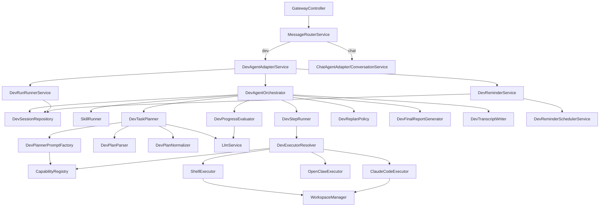
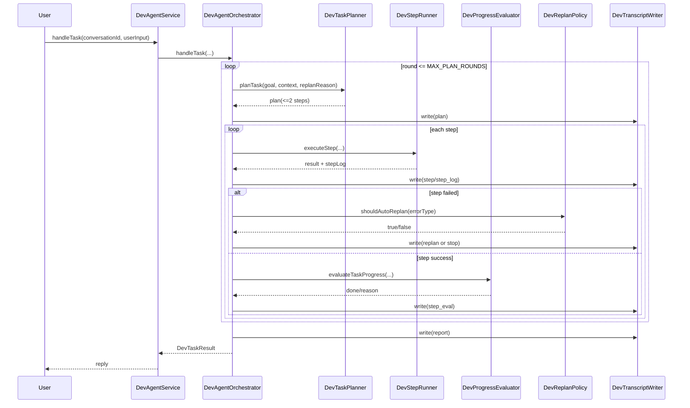

# DevAgent 架构说明（唯一文档）

> 创建：2026-03-11  
> 更新：2026-03-12  
> 状态：已上线（Phase 1-3 完成）

本文件是 DevAgent 的唯一设计与实现说明，替代原 `docs/dev-agent-plan.md`。

## 1. 目标与边界

### 1.1 目标

- 用户保持统一入口（仍然“对小晴说话”），系统内部做 channel 路由。
- Dev 任务与聊天主链隔离，避免污染 memory/summarizer/growth。
- DevAgent 主流程职责清晰可演进（orchestrator + planning/execution/reporting 分层）。

### 1.2 关键原则

- 前置路由：路由判定发生在 Message 落库前。
- 显式优先：`mode: 'dev'` 优先级最高。
- 保守降级：意图不确定时回退 chat。
- 薄入口：`DevAgentService` 不承载主流程细节。

### 1.3 明确不做

- 不改 `ConversationService` 业务主链。
- 不把 dev 消息写入聊天 memory/summarizer/post-turn。
- 不做自动代码提交、多 agent 自主协商。

## 2. 总体架构



## 3. 目录结构（现状）

```text
backend/src/
├── gateway/
│   ├── gateway.controller.ts
│   ├── message-router.service.ts
│   ├── message-router.types.ts
│   └── gateway.module.ts
├── dev-agent/
│   ├── dev-agent.service.ts          # 薄入口
│   ├── dev-agent.orchestrator.ts     # 主流程编排
│   ├── dev-agent.controller.ts
│   ├── dev-agent.types.ts
│   ├── dev-agent.constants.ts
│   ├── dev-agent.module.ts
│   ├── dev-session.repository.ts
│   ├── dev-runner.service.ts
│   ├── dev-reminder.service.ts
│   ├── dev-reminder.scheduler.service.ts
│   ├── planning/
│   │   ├── dev-task-planner.ts
│   │   ├── dev-planner-prompt.factory.ts
│   │   ├── dev-plan-parser.ts
│   │   └── dev-plan-normalizer.ts
│   ├── execution/
│   │   ├── dev-step-runner.ts
│   │   ├── dev-executor-resolver.ts
│   │   ├── dev-progress-evaluator.ts
│   │   └── dev-replan-policy.ts
│   ├── reporting/
│   │   ├── dev-final-report.generator.ts
│   │   └── dev-transcript.writer.ts
│   ├── workspace/
│   │   └── workspace-manager.service.ts
│   └── executors/
│       ├── executor.interface.ts
│       ├── shell.executor.ts
│       ├── openclaw.executor.ts
│       └── claude-code.executor.ts
└── xiaoqing/ ...
```

## 4. 路由规则（三层）

`POST /conversations/:id/messages`

路由优先级：
1. `mode = 'dev'` -> dev channel
2. `/dev` 或 `/task` 前缀 -> dev channel（去前缀后执行）
3. LLM 意图分类命中 `dev_task` -> dev channel
4. 其他 -> chat channel

约束：
- 第 3 层仅在前两层不命中时生效。
- 意图低置信度或分类异常时降级 chat。

## 5. DevAgent 职责拆分

### 5.1 入口层

- `DevAgentService`
  - `handleTask` 委派 `DevAgentOrchestrator`
  - 查询接口代理：`listSessions/getSession/getRun`
  - reminder 接口代理：`create/list/enable/trigger/delete`

### 5.2 编排层

- `DevAgentOrchestrator`
  - session/run 创建与状态推进
  - round loop / step loop
  - auto replan 触发与停止条件
  - 最终摘要与 run 落库
  - transcript 写入编排

### 5.3 规划层

- `DevTaskPlanner`: prompt -> llm -> parse -> normalize
- `DevPlannerPromptFactory`: 执行器说明 + allowlist + context 注入
- `DevPlanParser`: JSON 解析与 fallback
- `DevPlanNormalizer`: small-step 裁剪与 shell step 归一化

### 5.4 执行层

- `DevStepRunner`: preflight validate -> execute -> result/log normalize
- `DevExecutorResolver`: executor 解析（CapabilityRegistry 优先）
- `DevProgressEvaluator`: 轮中规则 + 轮末 LLM 完成度评估
- `DevReplanPolicy`: 自动重规划判定 + 失败建议
- `DevRunRunnerService`: per-session FIFO 队列（同 session 串行，不同 session 并行）
- `WorkspaceManager`: session 工作目录隔离（shared/worktree）

### 5.5 汇报层

- `DevFinalReportGenerator`: 最终回复生成
- `DevTranscriptWriter`: `transcript.jsonl` 写入

### 5.6 定时基础设施

- `DevReminderService`
  - 管理提醒任务（one-shot `runAt` / recurring `cronExpr`）
  - 到期触发时创建 `DevRun(status=queued)` 并交给 `DevRunRunnerService`
- `DevReminderSchedulerService`
  - `@Cron('*/15 * * * * *')` 轮询到期 reminder
  - 启动时执行一次补偿扫描，处理服务停机期间错过的触发

## 6. 主流程时序



## 7. 数据模型与产物

### 7.1 Prisma 模型

```prisma
model DevSession {
  id             String    @id @default(uuid())
  conversationId String?
  title          String?
  status         String    @default("active")
  createdAt      DateTime  @default(now())
  updatedAt      DateTime  @updatedAt
  runs           DevRun[]
  reminders      DevReminder[]
}

model DevRun {
  id           String   @id @default(uuid())
  sessionId    String
  session      DevSession @relation(fields: [sessionId], references: [id], onDelete: Cascade)
  userInput    String   @db.Text
  plan         Json?
  status       String   @default("pending")
  executor     String?
  result       Json?
  error        String?  @db.Text
  artifactPath String?
  startedAt    DateTime?
  finishedAt   DateTime?
  createdAt    DateTime @default(now())
  updatedAt    DateTime @updatedAt

  @@index([sessionId, createdAt])
  @@index([status])
}

model DevReminder {
  id              String   @id @default(uuid())
  sessionId       String
  message         String   @db.Text
  cronExpr        String?
  runAt           DateTime?
  timezone        String?
  enabled         Boolean  @default(true)
  nextRunAt       DateTime?
  lastTriggeredAt DateTime?
  lastRunId       String?
  lastError       String?  @db.Text
  createdAt       DateTime @default(now())
  updatedAt       DateTime @updatedAt

  @@index([enabled, nextRunAt])
}
```

### 7.2 文件产物

```text
backend/data/dev-runs/
  {runId}/
    transcript.jsonl
```

transcript phase：`plan/step/step_log/step_eval/replan/report/skill`。

## 8. API 合约

### 8.1 Gateway 统一入口

```ts
POST /conversations/:id/messages
body: { content: string; mode?: 'chat' | 'dev' }
```

### 8.2 DevAgent 查询接口

```ts
GET /dev-agent/sessions
GET /dev-agent/sessions/:id
GET /dev-agent/runs/:runId
GET /dev-agent/reminders?sessionId=:sessionId
POST /dev-agent/reminders
POST /dev-agent/reminders/:id/enable
POST /dev-agent/reminders/:id/trigger
DELETE /dev-agent/reminders/:id
```

### 8.3 DevTaskResult

```ts
interface DevTaskResult {
  session: { id: string; status: string };
  run: {
    id: string;
    status: string;
    executor: string | null;
    plan: DevPlan | null;
    result: unknown;
    error: string | null;
    artifactPath: string | null;
  };
  reply: string;
}
```

## 9. 稳定性与安全策略

### 9.1 执行稳定性

- small-step：每轮最多 2 步。
- 自动重规划：限定错误类型 + 最大次数。
- 连续失败熔断：达到上限停止自动执行。

### 9.2 Shell 安全

- 白名单首命令（如 `ls/cat/grep/find/node/npm/npx/git/curl`）。
- 黑名单防护（如 `rm/sudo/chmod/kill/shutdown` 等）。
- 30s timeout。
- 输出截断（100KB）。
- cwd 限制在 session workspace（无 session 时回退项目根目录）。

### 9.3 隔离边界

DevAgent 可依赖：`LlmService/OpenClawService/PrismaService/CapabilityRegistry`。  
DevAgent 不接入：`MemoryService/Summarizer/CognitivePipeline/ClaimEngine/PostTurn/DailyMoment`。  
完整的上下文边界约束见 `docs/context-boundary.md`。

## 10. 实施状态（历史）

- Phase 1：最小路由 + DevAgent 空壳（已完成）
- Phase 2：真实执行器 + 前端 dev 面板（已完成）
- Phase 3：目录重组 + action 层 + LLM 意图路由（已完成）

## 11. 验收清单

- 路由：显式/前缀/意图三层生效，且有正确降级路径。
- 隔离：dev 任务不进入聊天 memory/summarizer。
- 主流程：plan/execute/evaluate/replan/report 全链路可追踪。
- 工件：`transcript.jsonl` 含完整 phase 记录。
- 结构：`DevAgentService` 保持薄入口，无流程逻辑回流。
