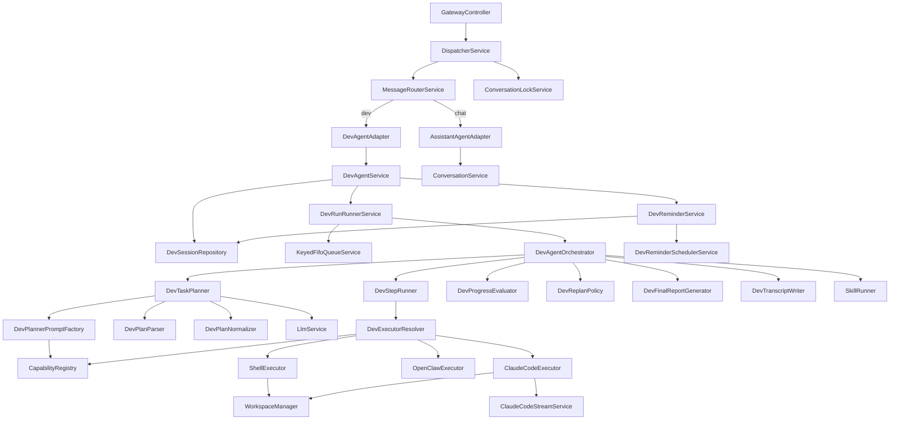
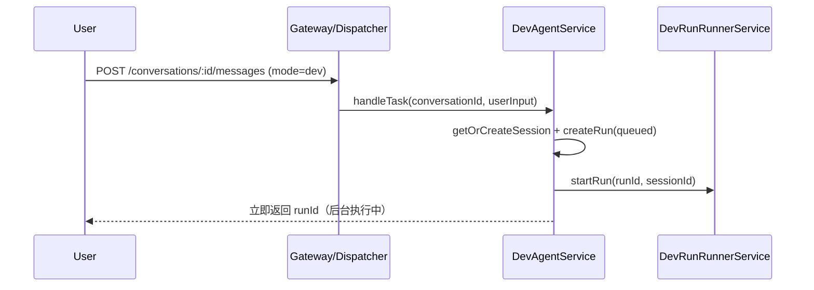
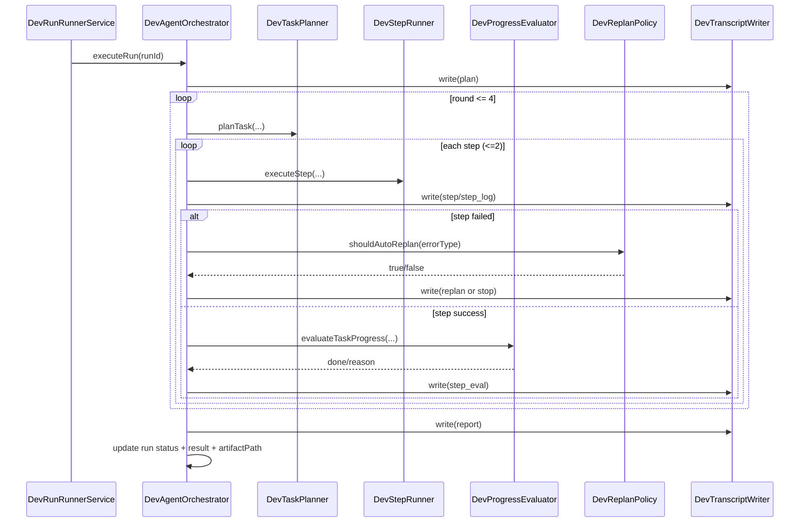

# DevAgent 架构说明（唯一文档）

> 创建：2026-03-11  
> 更新：2026-03-12  
> 状态：已上线（异步队列执行 + 提醒调度 + Claude Code 执行器）

本文件是 DevAgent 的唯一设计与实现说明，替代原 `docs/dev-agent-plan.md`。

## 1. 目标与边界

### 1.1 目标

- 用户保持统一入口（仍然“对小晴说话”），系统内部做 channel 路由。
- Dev 任务与聊天主链隔离，避免污染 memory/summarizer/growth。
- DevAgent 主流程职责清晰可演进（orchestrator + planning/execution/reporting 分层）。
- Dev 执行改为后台异步队列，前台快速返回 runId，支持查询/取消/重试。

### 1.2 关键原则

- 前置路由：路由判定发生在 Message 落库前。
- 显式优先：`mode: 'dev'` 优先级最高。
- 保守降级：意图不确定时回退 chat。
- 薄入口：`DevAgentService` 不承载主流程细节。
- 同会话串行：同一 `DevSession` 的 run 走 FIFO 串行，避免并发踩目录。

### 1.3 明确不做

- 不改 `ConversationService` 业务主链。
- 不把 dev 消息写入聊天 memory/summarizer/post-turn。
- 不做自动代码提交、多 agent 自主协商。

## 2. 总体架构



## 3. 目录结构（现状）

```text
backend/src/
├── gateway/
│   ├── gateway.controller.ts
│   ├── message-router.service.ts
│   ├── message-router.types.ts
│   └── gateway.module.ts
├── orchestrator/
│   ├── dispatcher.service.ts
│   ├── conversation-lock.service.ts
│   ├── assistant-agent.adapter.ts
│   ├── dev-agent.adapter.ts
│   └── orchestrator.module.ts
├── dev-agent/
│   ├── dev-agent.service.ts          # 薄入口（创建 run + 查询/取消/提醒代理）
│   ├── dev-agent.orchestrator.ts     # 主流程编排（plan/execute/evaluate/replan/report）
│   ├── dev-agent.controller.ts
│   ├── dev-agent.types.ts
│   ├── dev-agent.constants.ts
│   ├── dev-agent.module.ts
│   ├── dev-session.repository.ts
│   ├── dev-runner.service.ts         # 后台队列 + 恢复策略
│   ├── dev-reminder.service.ts
│   ├── dev-reminder.scheduler.service.ts
│   ├── planning/
│   │   ├── dev-task-planner.ts
│   │   ├── dev-planner-prompt.factory.ts
│   │   ├── dev-plan-parser.ts
│   │   └── dev-plan-normalizer.ts
│   ├── execution/
│   │   ├── dev-step-runner.ts
│   │   ├── dev-executor-resolver.ts
│   │   ├── dev-progress-evaluator.ts
│   │   └── dev-replan-policy.ts
│   ├── reporting/
│   │   ├── dev-final-report.generator.ts
│   │   └── dev-transcript.writer.ts
│   ├── workspace/
│   │   └── workspace-manager.service.ts
│   ├── executors/
│   │   ├── executor.interface.ts
│   │   ├── shell.executor.ts
│   │   ├── openclaw.executor.ts
│   │   ├── claude-code.executor.ts
│   │   └── claude-code-stream.service.ts
│   └── shell-command-policy.ts
└── xiaoqing/ ...
```

## 4. 路由规则（三层）

`POST /conversations/:id/messages`

路由优先级：
1. `mode = 'dev'` -> dev channel
2. `/dev ` 或 `/task ` 前缀 -> dev channel（去前缀后执行）
3. LLM 意图分类命中 dev -> dev channel
4. 其他 -> chat channel

约束：
- 第 3 层仅在前两层不命中时生效。
- 意图低置信度或分类异常时降级 chat。
- Dispatcher 对同一 `conversationId` 加锁，保证入口串行调度。

## 5. DevAgent 职责拆分

### 5.1 入口层

- `DevAgentService`
  - `handleTask`: `getOrCreateSession` + `createRun(status=queued)` + `startRun`（后台）
  - 快速返回 `runId`，不阻塞等待执行完成
  - 查询接口代理：`listSessions/getSession/getRun`
  - 控制接口代理：`cancelRun`
  - reminder 接口代理：`create/list/enable/trigger/delete`

### 5.2 运行层

- `DevRunRunnerService`
  - 使用 `KeyedFifoQueueService` 做 per-session 串行执行
  - `claimRunForExecution` 防重复抢占
  - 启动恢复：自动处理 `queued/pending/running` 中断任务
  - `DEV_RUN_RECOVER_RUNNING_STRATEGY=retry|fail` 控制 running 任务恢复方式

### 5.3 编排层

- `DevAgentOrchestrator`
  - 负责 round loop / step loop
  - 状态推进：`queued -> running -> success|failed|cancelled`
  - 自动重规划：最多 `MAX_AUTO_REPLAN=1`
  - 终止策略：最多 `MAX_PLAN_ROUNDS=4`、连续失败阈值 2
  - 支持 `/skill <name>` 直达本地技能执行（绕过 planner/step loop）

### 5.4 规划层

- `DevTaskPlanner`: prompt -> llm -> parse -> normalize
- `DevPlannerPromptFactory`:
  - 注入可用执行器说明（CapabilityRegistry）
  - 注入 shell allowlist
  - 强制 small-step（每轮最多 2 步）
  - 编码任务优先 `claude-code`
- `DevPlanParser`: JSON 解析失败时降级为单步 shell
- `DevPlanNormalizer`: 裁剪 steps，并对明显非法 shell 命令做低风险替换

### 5.5 执行层

- `DevStepRunner`: preflight 校验 -> 执行器执行 -> 结果/日志归一化
- `DevExecutorResolver`: 优先从 `CapabilityRegistry` 取执行器，否则回落内建执行器
- `DevProgressEvaluator`: 轮中规则 + 轮末 LLM 完成度评估
- `DevReplanPolicy`: 按错误类型决定是否自动重规划、失败建议文案

执行器：
- `ShellExecutor`
  - allowlist + blockedlist
  - 高风险语法拦截（管道/重定向/命令拼接等）
  - 低风险自动修复（如 `2>/dev/null`、`| head`）
  - 超时 30s，输出上限 100KB
- `OpenClawExecutor`
  - 委派到 `OpenClawService.delegateTask`
- `ClaudeCodeExecutor`
  - 委派到 `ClaudeCodeStreamService`（SDK 流式执行）
  - 支持 abort/cancel
  - 受 `FEATURE_CLAUDE_CODE=true` 开关控制

### 5.6 工作区隔离

- `WorkspaceManager`
  - `shared`：直接在项目目录执行（默认）
  - `worktree`：每 session 创建 git worktree 隔离分支
  - run 完成后释放 workspace；服务启动会清理孤儿 worktree

### 5.7 汇报层

- `DevFinalReportGenerator`: 生成面向用户的最终回复
- `DevTranscriptWriter`: `transcript.jsonl` 事件写入

### 5.8 提醒基础设施

- `DevReminderService`
  - 支持 one-shot（`runAt`）与 recurring（`cronExpr`）
  - scope：`dev | system | chat`
  - `dev` scope 到期后会创建 `DevRun(queued)` 并入队执行
  - `system/chat` scope 只更新触发状态，不创建 DevRun
- `DevReminderSchedulerService`
  - `@Cron('*/15 * * * * *')` 轮询到期提醒
  - 启动时执行一次补偿扫描
  - 受 `FEATURE_DEV_REMINDER` 开关控制

## 6. 主流程时序

### 6.1 用户发起任务（异步）



### 6.2 后台执行任务



## 7. 数据模型与产物

### 7.1 Prisma 模型（核心）

- `DevSession`
  - 状态：`active | completed | failed | cancelled`
- `DevRun`
  - 状态：`queued | pending | running | success | failed | cancelled`
  - 字段：`plan/result/error/executor/artifactPath/startedAt/finishedAt`
- `DevReminder`
  - 字段：`scope/title/message/cronExpr/runAt/timezone/enabled/nextRunAt/...`

> 以 `backend/prisma/schema.prisma` 为准。

### 7.2 文件产物

```text
backend/data/dev-runs/
  {runId}/
    transcript.jsonl
```

transcript phase：`plan/step/step_log/step_eval/replan/report/skill`。

## 8. API 合约

### 8.1 Gateway 统一入口

```ts
POST /conversations/:id/messages
body: { content: string; mode?: 'chat' | 'dev' }
```

### 8.2 DevAgent 查询与控制接口

```ts
GET /dev-agent/sessions
GET /dev-agent/sessions/:id
GET /dev-agent/runs/:runId
POST /dev-agent/runs/:runId/cancel

GET /dev-agent/reminders?sessionId=:sessionId
POST /dev-agent/reminders
POST /dev-agent/reminders/:id/enable
POST /dev-agent/reminders/:id/trigger
DELETE /dev-agent/reminders/:id
```

### 8.3 DevTaskResult（入口返回）

```ts
interface DevTaskResult {
  session: { id: string; status: string };
  run: {
    id: string;
    status: string; // 首次通常为 queued
    executor: string | null;
    plan: DevPlan | null;
    result: unknown;
    error: string | null;
    artifactPath: string | null;
  };
  reply: string; // “任务已接收，后台执行中”
}
```

## 9. 稳定性与安全策略

### 9.1 执行稳定性

- small-step：每轮最多 2 步。
- 自动重规划：限定错误类型 + 最多 1 次。
- 连续失败熔断：达到上限停止自动执行。
- 恢复机制：服务重启后恢复 queued/pending/running 任务。

### 9.2 Shell 安全

- 白名单首命令（`ls/cat/head/tail/wc/grep/find/...`）。
- 黑名单防护（`rm/sudo/chmod/kill/shutdown` 等）。
- 高风险语法拦截（`&&`、`||`、`;`、非受控重定向、复杂管道）。
- 低风险自动修复（`2>/dev/null` 与 `| head` 受控转换）。
- 30s timeout、100KB 输出截断。
- cwd 限制在 workspace（shared/worktree）。

### 9.3 隔离边界

DevAgent 可依赖：`LlmService/OpenClawService/PrismaService/CapabilityRegistry/Queue/Workspace`。  
DevAgent 不接入：`MemoryService/Summarizer/CognitivePipeline/ClaimEngine/PostTurn/DailyMoment`。  
完整上下文边界见 `docs/context-boundary.md`。

## 10. 能力总览（简版）

DevAgent 当前核心能力：
- 开发任务自动规划与执行（plan -> execute -> evaluate -> replan -> report）。
- 三类执行器协同：`shell`、`openclaw`、`claude-code`。
- 后台异步运行：提交即返回、可查询进度、可取消。
- 定时任务：一次性提醒与 cron 提醒，支持自动触发 DevRun。
- 运行隔离与安全治理：session 串行队列、workspace 隔离、命令安全策略。

## 11. 实施状态

- Phase 1：最小路由 + DevAgent 空壳（已完成）
- Phase 2：真实执行器 + 前端 dev 面板（已完成）
- Phase 3：目录重组 + action 层 + LLM 意图路由（已完成）
- 现状增强：异步队列执行、run cancel、提醒调度、多执行器编排（已完成）

## 12. 验收清单

- 路由：显式/前缀/意图三层生效，且有正确降级路径。
- 隔离：dev 任务不进入聊天 memory/summarizer。
- 主流程：plan/execute/evaluate/replan/report 全链路可追踪。
- 工件：`transcript.jsonl` 含完整 phase 记录。
- 运行：同 session 串行、支持中断恢复、支持 run 取消。
- 结构：`DevAgentService` 保持薄入口，无流程逻辑回流。
