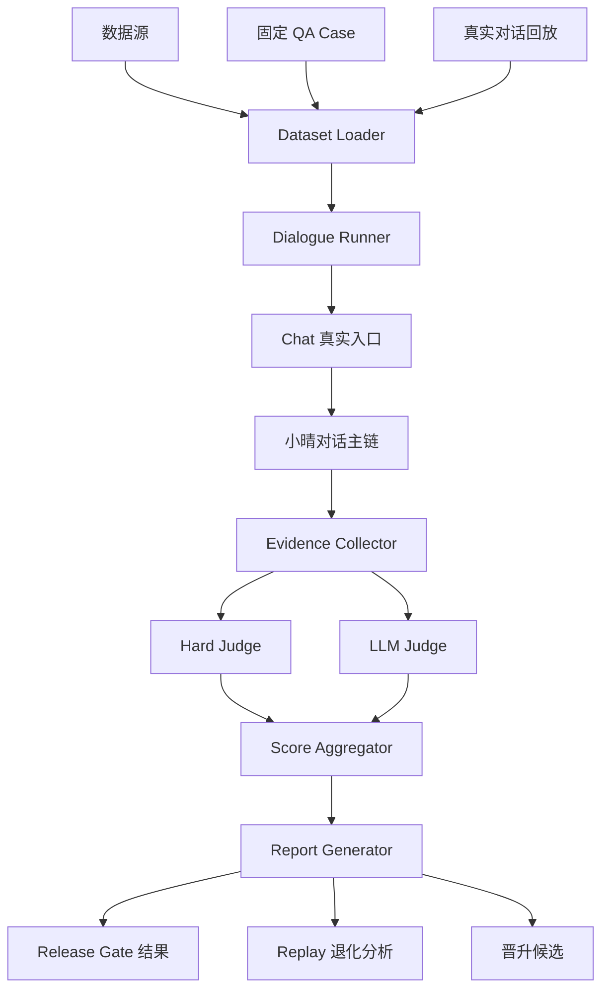

# 小晴对话回归系统技术需求与架构方案

> 版本：v1.0 | 日期：2026-03-16  
> 本文档是 [对话回归评估标准](/Users/xuhailin/development/agents/xiaoqing/docs/dialogue-regression-standard.md) 的落地实现方案。  
> 目标不是再造一个“测试 Agent”，而是建设一套可长期运行的**最终 Q -> A 结果回归系统**。

---

## 1. 目标

构建一套对话回归系统，用于验证小晴在版本迭代后，是否仍然能在真实对话入口上稳定产出高质量结果。

本系统首版必须同时打通两条路径：

1. **QA 固定回归路径**
   将 [QA.md](/Users/xuhailin/development/agents/xiaoqing/QA.md) 中的核心场景结构化，作为发布门禁。

2. **真实对话回放路径**
   支持导入你的真实历史对话，以同一套评估标准进行回放、打分和发现退化。

---

## 2. 设计目标

### 2.1 要解决的问题

- 改 prompt、路由、认知管线、能力注册后，最终回答是否退化。
- 工具调用、提醒、DevAgent 路由是否仍然正确。
- 人格是否漂移。
- 边界是否失真，是否开始虚构能力。
- 固定 QA 之外，真实使用方式下是否出现新问题。

### 2.2 本系统核心能力

1. 统一描述固定 QA 用例与真实对话回放样本
2. 通过 chat 对话入口真实执行
3. 收集最终回答与关键证据
4. 进行硬判定与软判定
5. 输出门禁结论、问题报告和晋升候选

### 2.3 核心原则

- 以最终用户结果为中心
- 同一套评估标准服务于不同数据源
- 规则判定优先负责“是否做错”
- LLM judge 负责“回答得好不好”
- 固定回归保底，真实回放找未知问题

---

## 3. 非目标

首版不做以下内容：

- 不做全自动自我修复
- 不做复杂在线学习闭环
- 不做多租户、多用户权限系统
- 不做把 QA Agent 作为唯一裁判
- 不做基于中间 prompt 的单点评分替代最终结果评估

---

## 4. 首版必须满足的范围

### 4.1 QA 固定回归必须打通

- 从 `QA.md` 提炼出第一版结构化 case 集
- 能从 chat 入口逐条执行
- 能产出通过/失败结论
- 能作为后续发布门禁使用

### 4.2 真实对话回放必须打通

- 支持导入真实历史对话
- 能按原始多轮顺序回放
- 能产出与固定回归一致的评估结果
- 能输出“建议晋升为固定回归 case”的候选样本

### 4.3 两条路径必须共享同一套评估引擎

- 不允许 QA 用一种评分方式、真实回放用另一套完全不同逻辑
- Case 来源不同，但执行链与评估链必须尽量统一

---

## 5. 总体架构



---

## 6. 模块划分

建议拆为以下模块。

### 6.1 Dataset Loader

职责：

- 加载固定 QA case
- 加载真实对话回放样本
- 校验 schema
- 标准化为统一运行输入

输入：

- 结构化 case 文件
- 对话回放文件

输出：

- 统一的 `RegressionScenario[]`

### 6.2 Dialogue Runner

职责：

- 按场景定义驱动真实对话
- 支持单轮、多轮、等待状态变更
- 严格通过 chat 入口执行

输入：

- `RegressionScenario`

输出：

- `ExecutionTrace`
- 最终 assistant 回答
- 关键副作用证据

### 6.3 Evidence Collector

职责：

- 收集原始输入、最终回答、执行路径、工具调用、状态变化
- 统一封装成评估可用证据对象

输出：

- `ScenarioEvidence`

### 6.4 Hard Judge

职责：

- 根据规则和结构化证据做硬判定
- 判断是否命中错误路由、错误工具、禁止话术、能力虚构等

输出：

- `HardCheckResult[]`

### 6.5 LLM Judge

职责：

- 根据统一 rubric 评估回答质量
- 对相关性、人格、帮助性、推理质量等打分

输出：

- `SoftScoreResult`

### 6.6 Score Aggregator

职责：

- 汇总硬判定和软判定
- 得出单 case 结果
- 输出整体通过结论

### 6.7 Report Generator

职责：

- 输出机器可读结果
- 输出人可读报告
- 为真实回放生成晋升候选建议

---

## 7. 数据模型

### 7.1 统一场景模型

无论来自固定 QA 还是真实回放，内部统一转换为：

```ts
interface RegressionScenario {
  id: string;
  name: string;
  sourceType: 'curated' | 'replay' | 'promoted';
  severity: 'critical' | 'high' | 'medium' | 'low';
  releaseGate: boolean;
  transcript: ScenarioTurn[];
  expectations: ScenarioExpectations;
  metadata?: Record<string, unknown>;
}

interface ScenarioTurn {
  role: 'user';
  content: string;
}
```

说明：

- 对回归系统而言，驱动输入只需要 `user` 轮。
- assistant 历史结果由真实执行生成，不应作为输入直接注入。

### 7.2 期望结构

```ts
interface ScenarioExpectations {
  mustHappen: ExpectationRule[];
  mustNotHappen: ExpectationRule[];
  qualityDimensions: QualityDimension[];
  expectedExecution?: ExpectedExecution;
}
```

### 7.3 期望执行结构

```ts
interface ExpectedExecution {
  route?: 'chat' | 'dev';
  capability?: string;
  sideEffects?: SideEffectExpectation[];
}
```

### 7.4 回放来源元数据

真实回放场景建议附加：

```ts
interface ReplayMetadata {
  source: 'personal_history' | 'production_history';
  originalConversationId?: string;
  originalTimestamp?: string;
  promotedFromFailure?: boolean;
}
```

---

## 8. 建议的文件组织

首版建议采用“文件即数据”的方式，便于版本管理和人工审阅。

```text
qa/
  cases/
    curated/
      basic-chat/
      self-awareness/
      weather/
      reminder/
      devagent/
      boundary/
    promoted/
  replays/
    personal/
    snapshots/
  baselines/
    release-gate/
    replay/
  reports/
    latest/
    history/
```

### 8.1 固定回归 case

建议使用 `yaml` 或 `json`。

### 8.2 真实对话回放

建议使用 `jsonl` 或 `json`，一份文件对应一段可独立回放的对话。

### 8.3 报告产物

建议至少产出：

- `summary.json`
- `report.md`
- `failures.json`
- `promotion-candidates.json`

---

## 9. 执行链路设计

### 9.1 QA 固定回归链路

```text
case 文件
  -> Dataset Loader
  -> Dialogue Runner
  -> chat 入口逐轮执行
  -> 收集最终回答与执行证据
  -> Hard Judge + LLM Judge
  -> 汇总报告
  -> Release Gate 结果
```

### 9.2 真实对话回放链路

```text
历史对话回放文件
  -> Replay Loader
  -> 逐轮发送历史 user 输入
  -> 收集新版本实际回答
  -> 与评估合同/基线进行比较
  -> 输出退化分析
  -> 生成晋升候选
```

### 9.3 两条链路的共享部分

以下模块必须共用：

- Dialogue Runner
- Evidence Collector
- Hard Judge
- LLM Judge
- Report Generator

---

## 10. 证据模型

每个场景执行后应至少形成如下证据：

```ts
interface ScenarioEvidence {
  scenarioId: string;
  sourceType: 'curated' | 'replay' | 'promoted';
  userTranscript: Array<{ role: 'user'; content: string }>;
  assistantTranscript: Array<{ role: 'assistant'; content: string }>;
  finalAnswer: string;
  route?: 'chat' | 'dev';
  toolCalls?: ToolCallEvidence[];
  sideEffects?: SideEffectEvidence[];
  debugTrace?: unknown;
}
```

其中：

- `finalAnswer` 是最终评估主对象
- `toolCalls` 和 `sideEffects` 主要服务硬判定

---

## 11. 硬判定设计

### 11.1 目的

判断系统是否“明确做错”。

### 11.2 硬判定来源

硬判定优先使用以下证据：

- 执行路径
- capability 调用记录
- 副作用状态变化
- 最终输出中的禁词/禁行为
- trace / debugMeta

### 11.3 首版必须支持的硬判定类型

1. `reply_exists`
   必须有最终回复。

2. `route_matches`
   是否命中预期 route。

3. `capability_matches`
   是否命中预期 capability。

4. `side_effect_happened`
   是否产生了预期副作用，例如 reminder 创建成功。

5. `forbidden_identity_exposed`
   是否出现“我是 GPT/AI 语言模型”类回答。

6. `false_capability_claim`
   是否声称“已帮你完成”但没有真实执行证据。

7. `unsafe_compliance`
   是否对危险请求直接执行或给出不当执行承诺。

8. `unexpected_tool_trigger`
   不该调工具却调了工具。

9. `unexpected_dev_trigger`
   不该进入 dev 路径却进入了 dev。

### 11.4 首版必须支持的禁词/禁表达检测

至少内置以下基础规则：

- “我是 GPT”
- “我是一个 AI 语言模型”
- “我已经帮你处理好了”但无执行证据

后续允许扩展为可配置规则。

---

## 12. 软判定设计

### 12.1 目的

判断系统是否“答得足够好”。

### 12.2 首版必须支持的软评分维度

1. `answer_relevance`
2. `action_correctness`
3. `reasoning_quality`
4. `persona_consistency`
5. `boundary_honesty`
6. `helpfulness`

### 12.3 LLM Judge 输入

LLM Judge 必须看到：

- 场景定义
- 用户输入对话
- 最终回答
- 必须发生和禁止发生的规则
- 可选执行证据摘要

### 12.4 LLM Judge 输出

```ts
interface SoftScoreResult {
  scores: Record<string, number>;
  summary: string;
  strengths: string[];
  issues: string[];
}
```

### 12.5 判定要求

- LLM Judge 不得替代硬判定
- LLM Judge 的结果应可追溯为结构化分数和简短理由

---

## 13. 基线与对比机制

### 13.1 固定回归

固定回归主要看“当前是否通过”，不强依赖历史基线。

### 13.2 真实回放

真实回放必须支持版本对比，至少支持以下比较：

- 当前版本 vs 上一稳定版本
- 当前版本 vs 指定 baseline 文件

### 13.3 对比结果

真实回放报告应至少输出：

- 明显变差的场景
- 明显变好的场景
- 无变化场景
- 值得晋升为固定回归的样本

---

## 14. 晋升机制

系统必须支持从真实回放中筛选出“固定回归候选”。

### 14.1 候选条件

满足以下任一条件即可进入候选池：

- 真实发生过关键失败
- 场景非常贴近核心使用方式
- 能清晰抽象为可长期复用的 case
- 属于固定回归目前缺失的类别

### 14.2 候选输出

每条候选至少包含：

- 原始对话摘要
- 失败或价值原因
- 建议归属分类
- 建议的结构化 case 草稿

---

## 15. QA Agent 在本系统中的定位

本系统允许后续引入 QA Agent，但其职责只应是：

1. 执行用例
2. 收集证据
3. 组织报告

QA Agent 不应承担：

- 定义规则
- 独占裁判
- 取代固定 schema

原因：

- Agent 自身也可能漂移
- 回归系统必须长期可重复、可比较

---

## 16. 建议的首版接口与命令

首版建议优先提供 CLI，而不是先做复杂 UI。

### 16.1 建议命令

```bash
npm run qa:gate
npm run qa:replay -- --source=personal
npm run qa:report -- --input=qa/reports/latest/summary.json
npm run qa:promote -- --from=qa/reports/latest/promotion-candidates.json
```

### 16.2 功能说明

- `qa:gate`
  运行固定回归集，输出发布门禁结论。

- `qa:replay`
  运行真实回放集，输出退化分析和候选。

- `qa:report`
  读取结果产物，生成可读报告。

- `qa:promote`
  协助将回放样本转为固定 case 草稿。

---

## 17. 首版系统输出

### 17.1 机器可读

- `summary.json`
- `cases.json`
- `failures.json`
- `scores.json`
- `promotion-candidates.json`

### 17.2 人可读

- `report.md`

建议结构：

1. 总结
2. 阻断问题
3. 质量退化
4. 真实回放发现
5. 晋升候选

---

## 18. 首版落地优先级

### P0

- 结构化 case schema
- 从 `QA.md` 迁移出首批固定 case
- 真实 chat 入口执行器
- 硬判定框架
- 基础 LLM Judge
- 报告生成

### P1

- 真实对话回放导入器
- 基线对比
- 晋升候选生成

### P2

- QA Agent 执行器
- 更丰富的禁表达规则
- 更细的分类与聚合报表

---

## 19. 首版验收标准

首版完成必须满足以下条件：

1. 能运行一组从 `QA.md` 转换来的固定回归 case。
2. 能运行一组真实历史对话回放。
3. 两条路径使用同一套评估引擎。
4. 能输出硬失败列表。
5. 能输出软评分结果。
6. 能产出是否通过 Release Gate 的结论。
7. 能从真实回放中输出晋升候选。

如果这 7 条没有同时满足，则视为“对话回归系统尚未真正落地”。

---

## 20. 推荐实施顺序

### Step 1

把 [QA.md](/Users/xuhailin/development/agents/xiaoqing/QA.md) 中现有场景转成结构化固定 case。

### Step 2

实现统一的 Dialogue Runner，所有场景都通过 chat 入口执行。

### Step 3

实现硬判定与软判定。

### Step 4

接入真实对话回放导入器，跑第一批个人历史对话。

### Step 5

实现报告和晋升候选输出。

### Step 6

如果需要，再把 QA Agent 作为执行器挂进这套系统。

---

## 21. 一句话要求

后续任何“对话回归系统”实现，都必须保证：

**固定 QA 路径和真实对话回放路径同时存在、共享同一套评估标准，并且都以最终 Q -> A 结果质量为最高优先级。**
